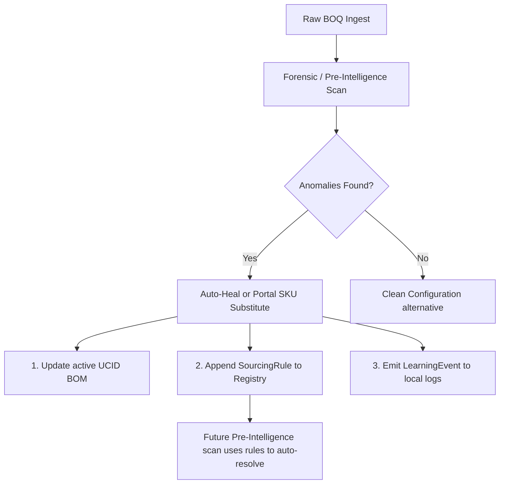

# VSIP Platform Sourcing Intelligence Learning Loop Pattern

This document outlines the architectural pattern for the automated learning loop integrated within the Vendor Solution Intelligence & Procurement Integrity (VSIP) Platform.

## Core Flow Architecture

When a sourcing anomaly or validation error is detected (either during pre-intelligence BOQ scans, partner portal dry-runs, or manual audits) and resolved, the system records this resolution as a learned behavior. Future scans apply this rule pre-emptively.

## Key Code Integration Paths

### 1. Auto-Heal & Rule Promotion
Located in [ForensicView.tsx](file:///home/vinodh/FigmaUxDesign/VendorSolutionFigmaStudio/src/components/forensics/ForensicView.tsx#L286-L428):
- Clicking `Auto-Heal Threat` updates `ucids` state with corrected hardware parts.
- Promotes the mapping to `sourcingRules` registry state.
- Emits a `LearningEvent` via `emitLearningEvent()` containing the rule details, confidence metrics, and estimated mismatch counts.

### 2. CLIC Portal Ingestion Error Substitution
Located in [VendorIngestionDesk.tsx](file:///home/vinodh/FigmaUxDesign/VendorSolutionFigmaStudio/src/components/vendor-portal/VendorIngestionDesk.tsx#L357-L387):
- Playwright diagnostics catch partner portal validation errors (e.g. unbuildable/discontinued SKUs).
- Renders `PortalErrorResolutionPanel` showing alternate candidate SKUs from catalog.
- Applying a substitute triggers UCID BOM updates, flags the portal error as resolved, and logs the learning.

## Persistence & State Keys

All state is persisted in client localStorage to preserve configuration memory:
- **Active Sourcing Rules Registry:** Saved under the `sys_sourcing_rules` localStorage key.
- **Learning Loop Timelines:** Saved under the `sys_learning_events` localStorage key.

Future AI agents can read and parse these keys to inspect the learned catalog mappings and determine substitution context.
